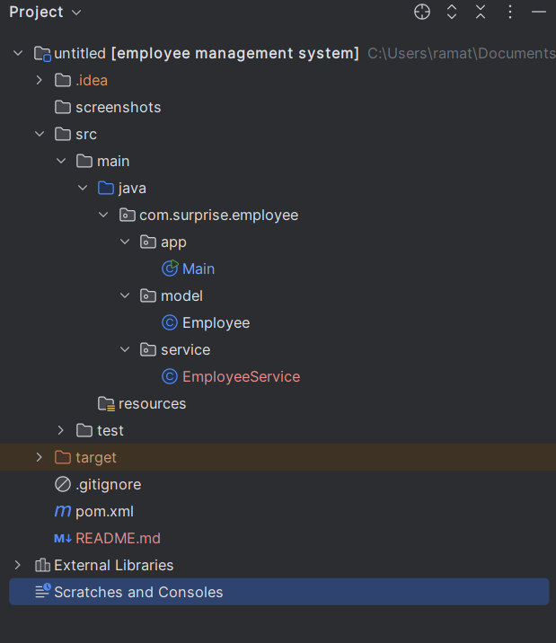
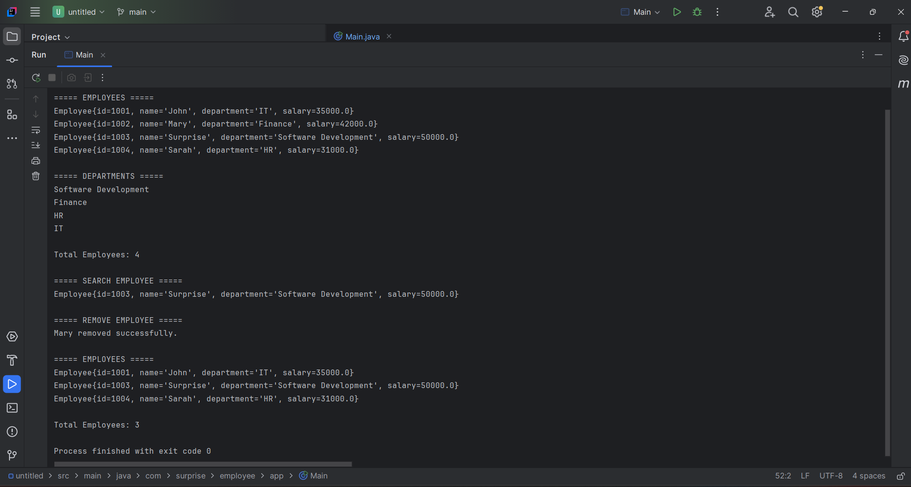
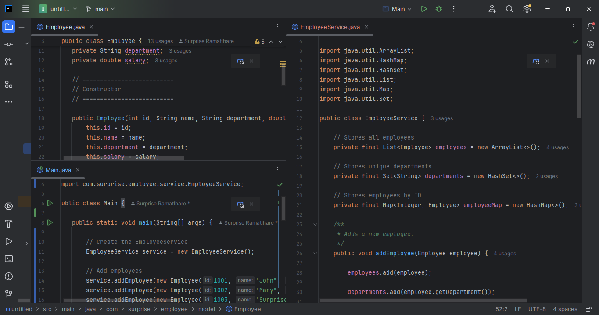
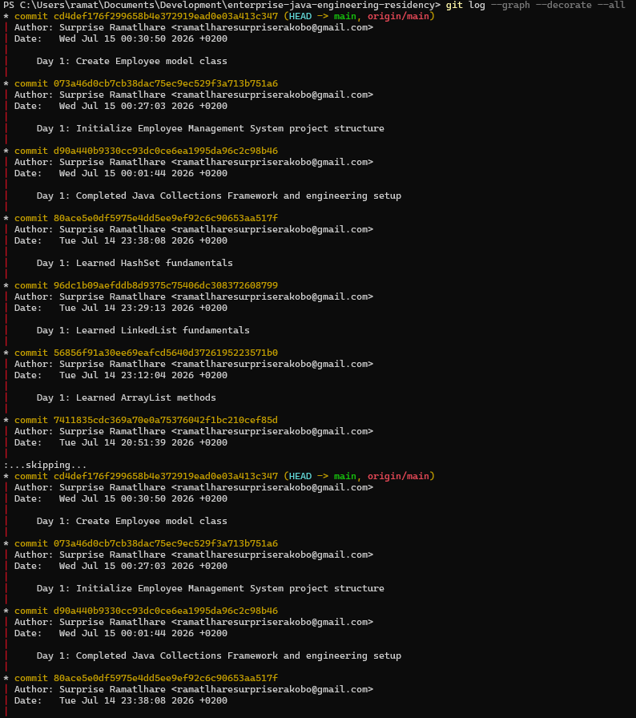

# Employee Management System


---

# Employee Management System

A Java console application developed using **Object-Oriented Programming (OOP)** and the **Java Collections Framework**.

This project was built as **Day 1** of my **Enterprise Java Engineering Residency**, a structured four-month software engineering bootcamp where I am documenting every lesson, project, and Git commit while preparing for enterprise Java development.

The objective of this project is to demonstrate clean code organization, proper software architecture, and practical usage of Java Collections through a simple employee management application.

---

# Features

- Add new employees
- Remove employees
- Search employees by ID
- Display all employees
- Count total employees
- Display unique departments
- Store employees using Java Collections
- Clean package organization
- Separation of concerns using Model-Service architecture

---

# Technologies Used

- Java 21 (LTS)
- Maven
- IntelliJ IDEA
- Git
- GitHub

---

# Java Concepts Demonstrated

### Object-Oriented Programming

- Classes
- Objects
- Constructors
- Encapsulation
- Methods
- Packages

### Java Collections Framework

- ArrayList
- HashSet
- HashMap

### Core Java

- Enhanced For Loop
- Collections API
- Object References
- Method Calls

### Software Engineering Practices

- Layered Project Structure
- Clean Code
- Git Version Control
- Documentation

---

# Project Structure

```text
employee-management-system
│
├── screenshots
│
├── src
│   └── main
│       └── java
│           └── com
│               └── surprise
│                   └── employee
│                       ├── app
│                       │   └── Main.java
│                       │
│                       ├── model
│                       │   └── Employee.java
│                       │
│                       └── service
│                           └── EmployeeService.java
│
├── README.md
├── pom.xml
└── .gitignore
```

---

# Project Architecture

```text
                Main
                  │
                  ▼
        EmployeeService
      ┌───────┼─────────┐
      ▼       ▼         ▼
 ArrayList  HashSet   HashMap
Employees Departments Employee Lookup
```

The project follows a simple layered architecture.

- **Model** contains the application data.
- **Service** contains the business logic.
- **Main** controls the execution flow of the program.

---

# Screenshots

## Project Structure



---

## Running Application



---

## Source Code Overview



---

## Git History



---

# Sample Output

```text
===== EMPLOYEES =====

Employee{id=1001, name='John', department='IT', salary=35000.0}
Employee{id=1002, name='Mary', department='Finance', salary=42000.0}
Employee{id=1003, name='Surprise', department='Software Development', salary=50000.0}
Employee{id=1004, name='Sarah', department='HR', salary=31000.0}

===== DEPARTMENTS =====

Software Development
Finance
HR
IT

Total Employees: 4

===== SEARCH EMPLOYEE =====

Employee{id=1003, name='Surprise', department='Software Development', salary=50000.0}

===== REMOVE EMPLOYEE =====

Mary removed successfully.

===== EMPLOYEES =====

Employee{id=1001, name='John', department='IT', salary=35000.0}
Employee{id=1003, name='Surprise', department='Software Development', salary=50000.0}
Employee{id=1004, name='Sarah', department='HR', salary=31000.0}

Total Employees: 3
```

---

# Skills Demonstrated

- Java Programming
- Object-Oriented Programming
- Java Collections Framework
- Data Structures
- Clean Code Principles
- Software Architecture
- Git Version Control
- Maven Project Management
- Documentation
- IntelliJ IDEA

---

# Future Improvements

This project will continue to evolve throughout my Java Engineering Residency.

Planned improvements include:

- User input using Scanner
- Exception handling
- Input validation
- Sorting employees
- Searching by department
- Updating employee information
- File persistence
- Java Streams API
- Lambda Expressions
- JUnit 5 Unit Testing
- Logging with SLF4J
- MySQL Database Integration
- Spring Boot REST API
- Docker Containerization
- Microservices Architecture

---

# Learning Journey

This project is part of my **Enterprise Java Engineering Residency**, where I am committing code daily and building enterprise-level Java applications.

Bootcamp Progress

- ✅ Day 1 — Java Collections & Employee Management System
- ⏳ Day 2 — Generics, Iterators & Streams
- ⏳ Day 3 — Exception Handling & File I/O
- ⏳ Day 4 — Java Functional Programming
- ⏳ Spring Boot Development
- ⏳ REST API Development
- ⏳ Database Integration
- ⏳ Docker & Kubernetes
- ⏳ Microservices
- ⏳ AWS Cloud Deployment

---

# Author

**Surprise Ramatlhare**

Java Software Engineer (In Training)

Enterprise Java Engineering Residency

GitHub: https://github.com/surprise-ramatlhare-dev

---

# License

This project is licensed under the MIT License.

---

## Connect With Me

I am continuously building enterprise Java applications while documenting my learning journey.

If you have feedback, suggestions, or would like to connect, feel free to reach out through GitHub.

⭐ If you found this project useful, consider giving it a star.